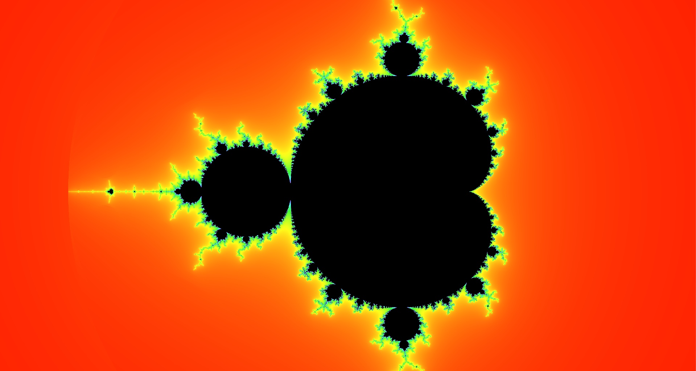

# Fractol

Fractol is a project that explores the world of fractals writen in C.

### Preview



## Table of Contents

- [Getting Started](#getting-started)
- [Prerequisites](#prerequisites)
- [Building](#building)
- [Running](#running)
- [Usage](#usage)
- [Acknowledgments](#Acknowledgments)
- [License](#license)

## Getting Started

These instructions will get you a copy of the project up and running on your local machine.

### Prerequisites

Make sure you have the following installed:

- GCC
- Make
- OpenGL
- Appkit

### Building

To build the project, run the following command in the project root directory:

```sh
make all
```

### Running

After building the project, you can run it with:

```sh
./fractol Mandelbrot
```

### Available fractols:

- ❄️ Mandelbrot ️
- ❄️ Julia (Interactive)
- ❄️ Burningship ️
- ❄️ Rabbit ️
- ❄️ Tricorn ️
- ❄️ Dragon ️

### Usage

- `spacebar` to toggle options
- `mouse wheel` to zoom in/ out
- `+ -` to increase/descrease fractol details

### Project Structure

The project has several key components:

- `src/:` Contains the source files for the project.
- `include/:` Contains the header files.
- `libft/:` Contains the source and header files for my rewite of the libft library.
- `minilibx/:` Contains the source and header files for the minilibx library.
- `images/:` Contains image resources used in the project.

### Acknowledgments

- Hat tip to the authors of minilibx

### License

This project is licensed under the MIT License
